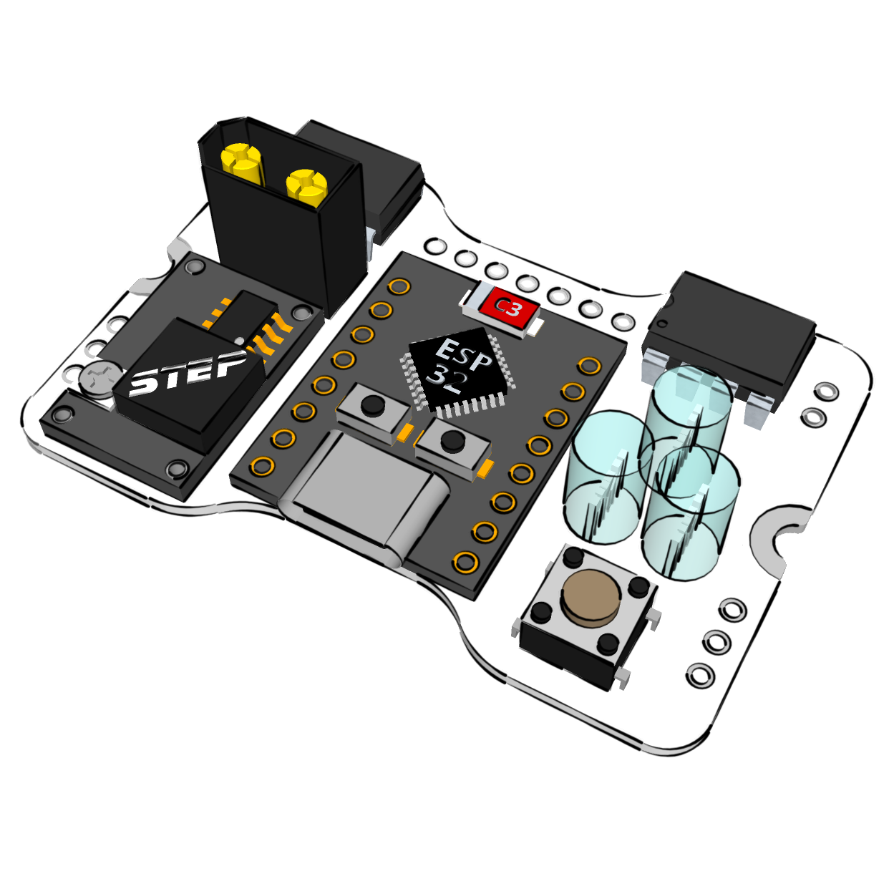

# PX-CORE | Placa multiusos para robots

Es la placa principal de control común a todos nuestros kits PX. Está pensada para poder usarse en casi cualquier tipo de robot.

[Más información](http://oprobots.github.io/modulos/px-core/ "Más información y conjunta")

*en construcción*